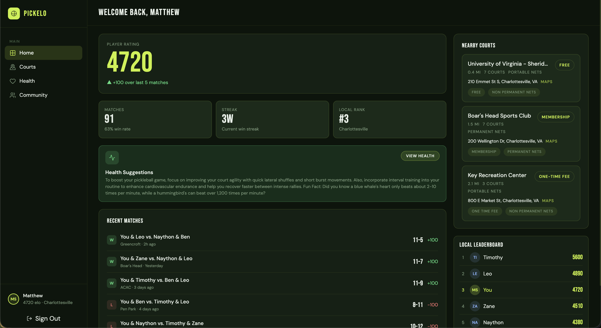
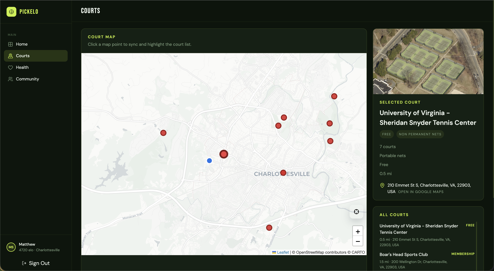
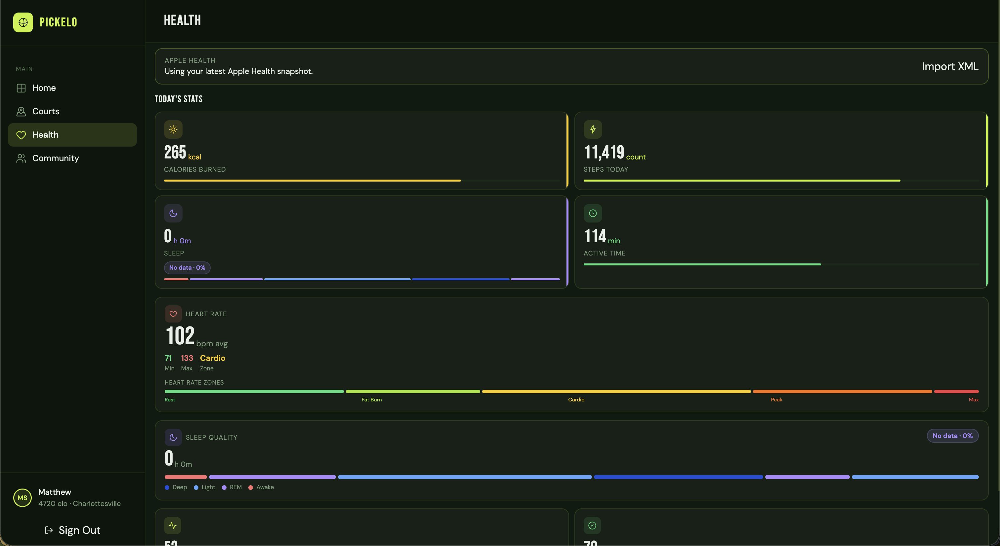
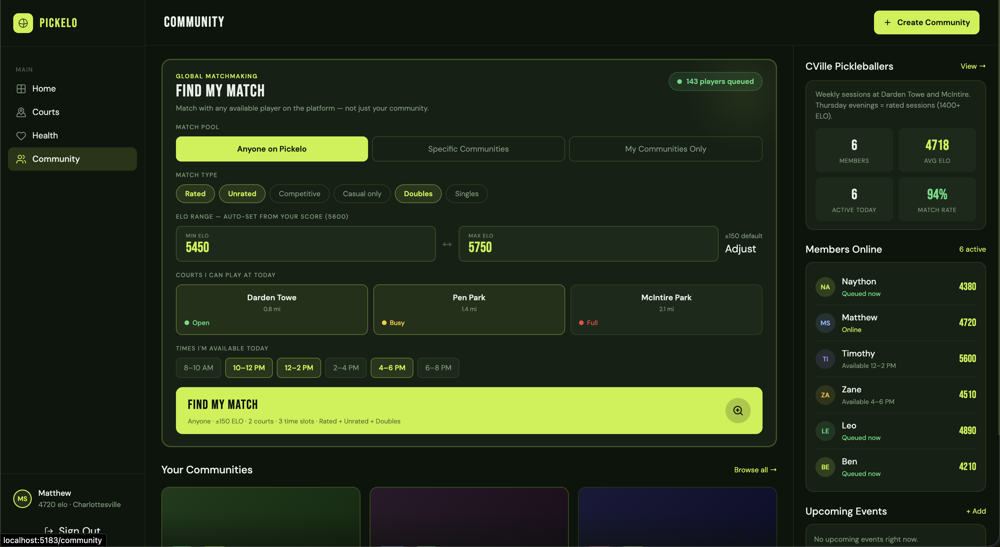

# Pickelo

# Made by
Timothy Park  
Matthew Seo  
Minh Quan Le  
Zane Geadah  

## Screenshots

### Home Dashboard

### Court Insights

### Health Insights

### Community Insights

# Inspiration
Pickleball is one of the fastest-growing sports in the country, and for good reason. It's accessible, social, and genuinely fun. But as we kept playing, we noticed something missing: there was no lightweight, casual way to track how good you actually were relative to your friends and local community. Existing rating systems are built around formal tournaments, leaving recreational players with no real sense of progression or competitive stakes.

That got us thinking about what makes games so addictive. Whether it's a ranked mode in a video game or a leaderboard at the arcade, people are fundamentally motivated by competition and measurable growth.

We wanted to bring that same energy to the pickleball court: a system that gives casual players a real Elo rating that updates after every match, not just tournament play.

Pickelo was born from the belief that a little healthy competition is one of the best motivators to get outside and stay active. If people can see their rating climb with every win, they'll keep coming back to the court–and that's a win for health and wellness too.

# What it does
Pickelo is a pickleball Elo rating platform for casual players. After every match, you log the score and your rating updates automatically very simply. A win gets you +100 elo, and a loss gets you -100.

From your dashboard you can track your rating over time, see your win rate and current streak, and check the local leaderboard to see where you stack up in your city. Beyond just a dashboard of rankings, there is a map feature which shows pickleball courts in your city, with information such as fees and net types. You can also join or create communities, like a group for your local courts, and use the global matchmaking system to find opponents at your skill level at courts near you, filtered by time slot and match type.

# How we built it
Pickelo utilizes the Apple Health Kit to collect health data from a given user. We then further implemented MCP (Model Context Protocols) to give a chatbot context to give suggestions about a given health data to a user. Various elements were made to allow matchmaking for pickleball and overall be a standalone hub for all of pickleball.

# Challenges we ran into
The biggest challenge we ran into was updating current health data from a user and then using MCP as a tool to enhance that data.

# Accomplishments that we're proud of
We are proud to be able to create an app that creates a hub for pickleball. Whether it be improving health metrics or finding new people to play against competitively, the app provides an approachable way to improve your game and find more play.

# What we learned
During this project, we learned about the integration of the Gemini API and the MCP. Furthermore, we learned about how to use Apple Health Kit, and also implement and use data throughout the app.

# What's next for Pickelo
We want to deploy Pickelo publicly so real communities can start using it, bringing a competitive layer to casual pickleball and hopefully pulling new people into this fun, active sport in the process. We're also planning to build native iOS and Android apps in Swift and Kotlin to make logging matches and checking your rating as convenient as possible.
